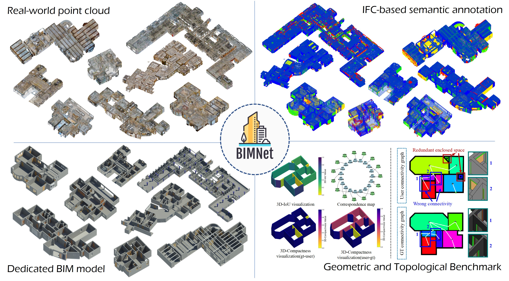
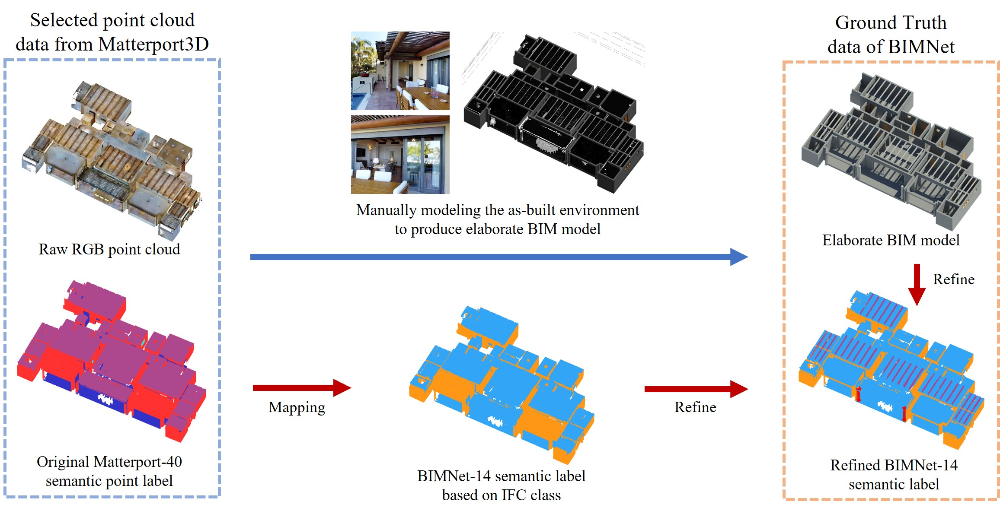
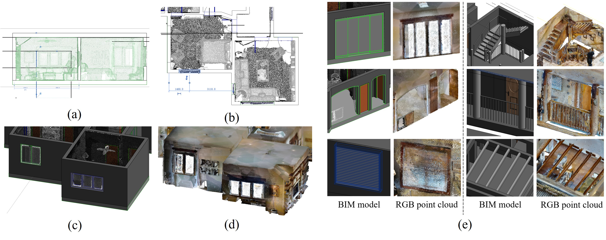
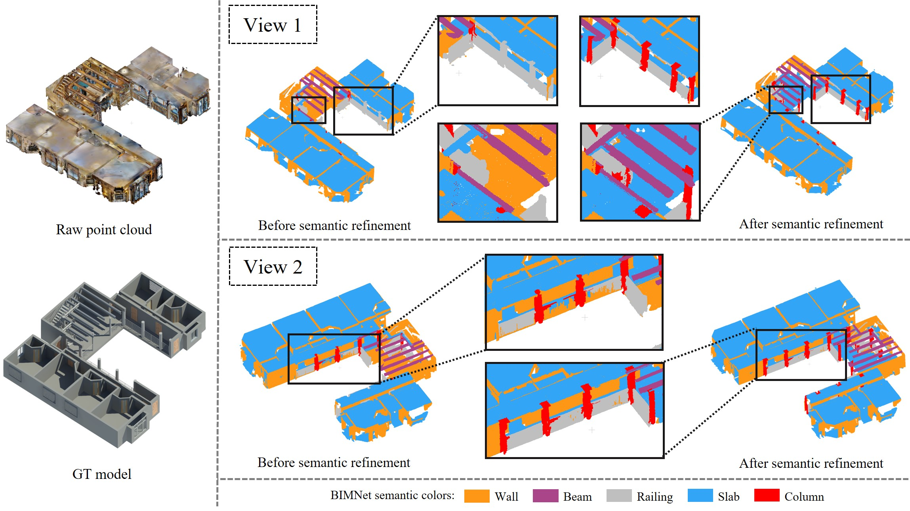

<header>
<h1>
<b>BIMNet:</b> Dataset and benchmark for as-built BIM reconstruction from real-world point cloud</h1>

Automation in Construction, 2025

<section id="authors">
<a class="name">Yudong Liu</a>, 
<a class="name" href="https://github.com/alvin528">Han Huang</a>,
<a class="name">Ge Gao&#x2709;</a>, 
<a class="name">Ziyi Ke</a>,
<a class="name" href="https://github.com/list17">Shengtao Li</a>,
<a class="name">Ming Gu</a> 
</section>
<h4>School of software, Tsinghua University</h4>

&#x2709;Corresponding Author

</header>

## 📝 Abstract
As-built BIM reconstruction plays a significant role in urban renewal and building digitization but currently faces challenges of low efficiency. Scan-to-BIM aims to improve reconstruction efficiency but lacks domain-specific, large-scale datasets and accurate, multi-dimensional benchmark metrics. These deficiencies further impede the evaluation and training of scan-to-BIM methods.

To address these challenges, this paper proposes BIMNet, an IFC-based large-scale point cloud to BIM dataset, and a set of metrics that reflect the quality and issues of reconstructed models from both geometric and topological perspectives. Experiments demonstrate that BIMNet enhances the evaluation and training of scan-to-BIM methods during the critical processes of reconstruction and segmentation. This research contributes to the data foundation and metric system for deep-learning based scan-to-BIM methods. In the future, BIMNet will not only facilitate the development of scan-to-BIM but also contribute to the advancement of smart cities and AI-driven technologies beyond scan-to-BIM.

## 🔍 Overview

**Features:**

- **Real-world point cloud:** Filtered and cleaned raw point clouds originate from [Matterport3D](https://niessner.github.io/Matterport/).
- **IFC-based semantic annotation:** 14-category point cloud semantics designed based on [IFC](https://standards.buildingsmart.org/IFC/DEV/IFC4_2/FINAL/HTML/) (Industry Foundation Classes).
- **Dedicated BIM model:** Manually modeled high-fidelity BIM model for each scan with Revit.
- **Domain-specific benchmark:** Novel geomertic and topologic benchmark for scan-to-BIM.

## 📊 Dataset
The data download link will be released soon. We welcome you to visit our [homepage](https://thucbims.github.io/bimnet.thucbims.github.io/) to preview data samples.

 
<em>Figure 1: Workflow for constrcuting BIMNet dataset.</em>
 
 

 
<em>Figure 2: Manual modeling procedure. (a) Component measurement
in the section view. (b) Component selection and placement in the plan view.
(c) Reconstructed BIM model. (d) RGB point cloud. (e) Strictly modeled components according to the raw point cloud.</em>
 
 

 
<em>Figure 3: Automated point cloud semantic annotation refinement.</em>

## 📜 License

The original data from Matterport3D dataset is released under <a href="https://kaldir.vc.in.tum.de/matterport/MP_TOS.pdf">Terms of Use</a> agreement. The part of our datset is under <a href="https://raw.githubusercontent.com/vsislab/Matterport3D-Layout/master/LICENSE.txt">MIT Liscence</a>.

## 📧 Contact

Please contact us at thubimnet@outlook.com if you have any questions.

